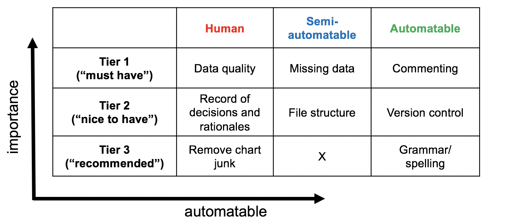

[](http://www.repostatus.org/#wip) [](https://travis-ci.org/noamross/checkers)

checkers
========

**checkers** is a framework for reviewing analysis projects. This package provides both automatied checks for best practises as well as a descriptive guide for best practices.

Analysis Review Criteria
========================

Our full, in-development analysis review guide is available [here as a google doc](https://docs.google.com/document/d/1OYcWJUk-MiM2C1TIHB1Rn6rXoF5fHwRX-7_C12Blx8g/edit#). We categorize checks according to tiers of 'best practise' and potential degree of automation:

Example check 'best practices' in terms of their importance (y-axis) and the degree they can be automated (x-axis). 

Automated checks
================

The **checkers** package runs automated tests, using extensions on the [**goodpractice**](https://github.com/MangoTheCat/goodpractice/) package.

#### Installation:

``` r
devtools::install_github('ropenscilabs/goodpractice')
```

#### Usage

Run `gp_check()` on your analysis directory for a report on common best practices for analysis directories.

``` r
library(checkers)
gp_check(path=system.file("scripts", package="checkers"),
         checks=c("comments", "version_control"))
```

    #> Preparing: scripts

    #> Preparing: version_control

    #> ── GP scripts ─────────────────────────────────────────────────────────────
    #> 
    #> It is good practice to
    #> 
    #>   ✖ Place your project under version control. You are using
    #>     neither git nor svn. See http://happygitwithr.com/ for more
    #>     info
    #> ───────────────────────────────────────────────────────────────────────────

Helper functions allow one to create custom checks for common tasks. For instance, `make_pref_pkg_check()` defines a test for preferred packages. These helpers are used with **goodpractice**'s (in-development) API for extensions:

``` r
xml_check <- make_pref_pkg_check(unfavored = "XML", favored = "xml2")
gp_check(path=system.file("scripts", package="checkers"),
         checks="xml",
         extra_preps = list(packages=prep_packages),
         extra_checks = list(xml=xml_check))
```

    #> Preparing: packages

    #> ── GP scripts ─────────────────────────────────────────────────────────────
    #> 
    #> It is good practice to
    #> 
    #>   ✖ Use preferred packages. xml2 is preferred to XML.
    #> ───────────────────────────────────────────────────────────────────────────

**checkers** has a growing list of default checks but may also be configured for personal or group preferences. A YAML file may be provided to set project-, user- or system-wide defaults for checks:

    package: "assertthat" #using this package?
    goodpractice:
      ["lintr_assignment_linter",
      "lintr_line_length_linter",
      "lintr_trailing_semicolon_linter" ,
      "lintr_attach_detach_linter",
      "lintr_setwd_linter",
      "lintr_sapply_linter",
      "lintr_library_require_linter",
      "lintr_seq_linter"]
    make_pref_pkg_check:
      XML:
        favored: xml2
        unfavored: ["XML"]
      JSON:
        favored: jsonlite
        unfavored: rjson
    if_this_than_that: ["gam","gam.check"] #if gam than gam.check
    comment_threshold: 0.05

------------------------------------------------------------------------

Review checklist framework
--------------------------

### Automation Levels

-   **Fully automatable:** Can be checked automatically by checkers (CURRENTLY GREEN)
-   **Semi-automatable:** Needs a human to provide commands on specific checks; can be done using custom implementations of checkers/goodpractice (CURRENTLY BLUE)
-   **Human-powered:** Analyst uses guidelines to make sure analysis and report fit best practice for specific context (CURRENTLY RED)

### Tiers

-   **Must have** : These elements are required for reliable and trustworthy analyses.
-   **Nice to have** : These elements are recommended for best practice and reproducibility and should be strongly considered.
-   **Recommended** : These elements are ideal best practice.

Automatable examples
--------------------

### 1. **Automatable & "Must have"**

-   **Research phase :** Data
-   **Name :** Commenting
-   **Description :** It is important to comment your code so that you can remember what you have written and created. It also allows you to share with other people.
-   **Example :** Check to see if you have commented each code chunk. What is the % of comments contained in your code?
-   **Automation:** Potential

### 2. **Automatable & "Nice to have"**

-   **Research phase :** Package/Organisational
-   **Name :** Version control
-   **Description :** It is important to store versions of your code as you program so you can go back to old versions of your analysis. This is important to help you debug and also help with collabration with others using tools like git/github or other version control providers.
-   **Example :** Check to see if you have a git file
-   **Automation:** implemented in **checkers**

### 3. **Automatable & "Recommended"**

-   **Research phase :** Visualisation/Reporting
-   **Name :** Grammar/Spelling
-   **Description :** It is important that you have correct spelling and grammar in code and reporting.
-   **Example :** Check that you have installed gramR *new* packag
-   **Automation:** In development, see (**gramr**)\[<https://github.com/ropenscilabs/gramr>\]
